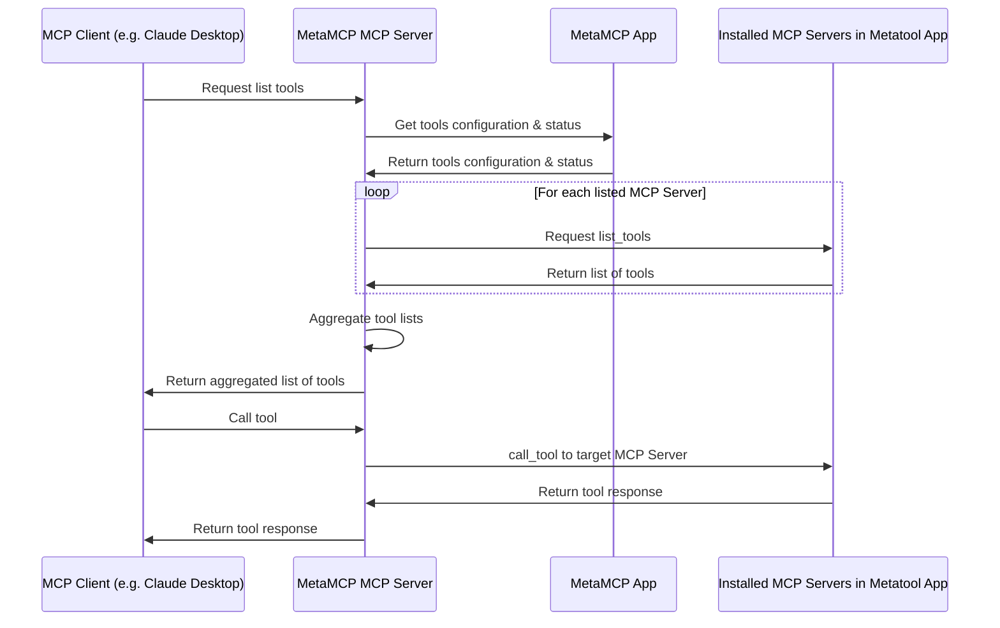

# MetaMCP MCP Server

[https://metamcp.com](https://metamcp.com): The One MCP to manage all your MCPs

MetaMCP MCP Server is a proxy server that joins multiple MCP⁠ servers into one. It fetches tool/prompt/resource configurations from MetaMCP App⁠ and routes tool/prompt/resource requests to the correct underlying server.

<a href="https://glama.ai/mcp/servers/0po36lc7i6">
  
</a>

MetaMCP App repo: https://github.com/metatool-ai/metatool-app

## Installation

### Installing via Smithery

To install MetaMCP MCP Server for Claude Desktop automatically via [Smithery](https://smithery.ai/server/@metatool-ai/mcp-server-metamcp):

```bash
npx -y @smithery/cli install @metatool-ai/mcp-server-metamcp --client claude
```

### Manual Installation

```bash
export METAMCP_API_KEY=<env>
npx -y @metamcp/mcp-server-metamcp@latest
```

```json
{
  "mcpServers": {
    "MetaMCP": {
      "command": "npx",
      "args": ["-y", "@metamcp/mcp-server-metamcp@latest"],
      "env": {
        "METAMCP_API_KEY": "<your api key>"
      }
    }
  }
}
```

## Highlights

- Compatible with ANY MCP Client
- Multi-Workspaces layer enables you to switch to another set of MCP configs within one-click.
- GUI dynamic updates of MCP configs.
- Namespace isolation for joined MCPs.

## Environment Variables

- METAMCP_API_KEY: Required. Obtained from MetaMCP App's "API Keys" page (https://metamcp.com/api-keys).
- METAMCP_API_BASE_URL: Optional override for MetaMCP App URL (e.g. http://localhost:12005).

## Command Line Arguments

You can configure the API key and base URL using command line arguments:

```bash
npx -y @metamcp/mcp-server-metamcp@latest --metamcp-api-key <your-api-key> --metamcp-api-base-url <base-url>
```

For help with all available options:

```bash
npx -y @metamcp/mcp-server-metamcp@latest --help
```

These command line arguments take precedence over environment variables.

## Architecture Overview



## Credits

- Inspirations and some code (refactored in this project) from https://github.com/adamwattis/mcp-proxy-server/